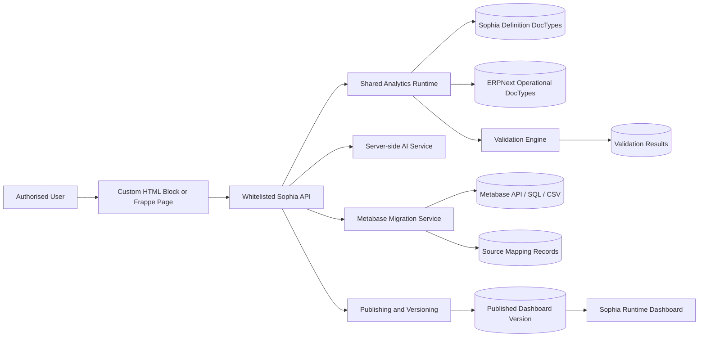
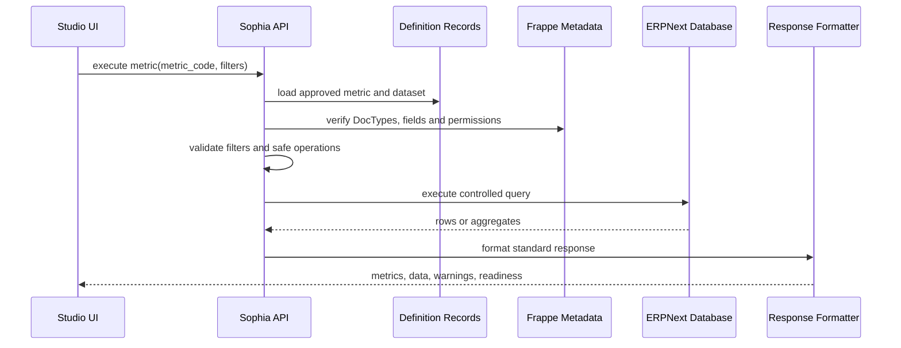
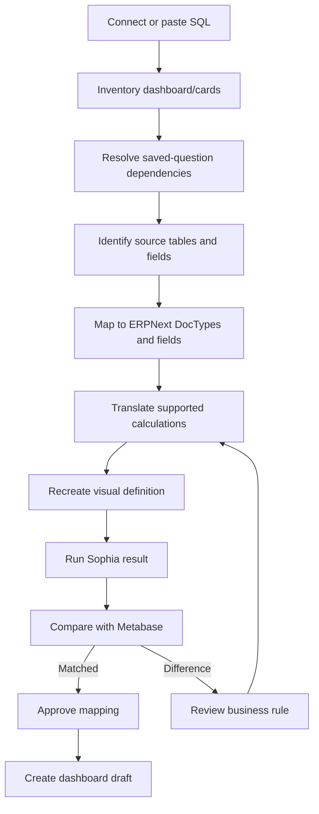
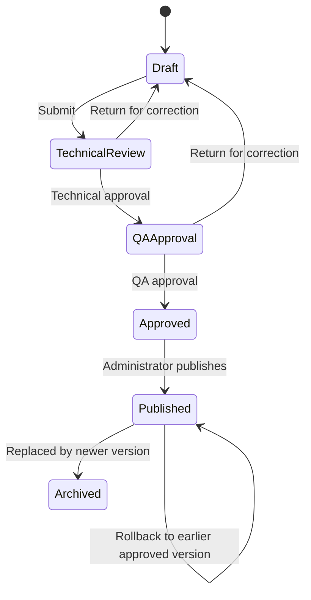
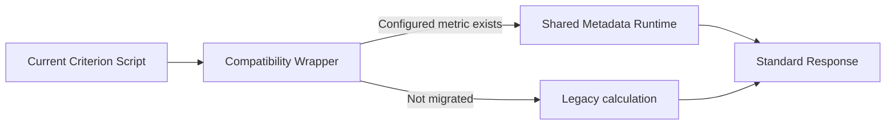

# Sophia Analytics Studio
## Master Project Concept, Business Case, Product Specification, Technical Handover and Implementation Guide

**Organisation:** United Ceres College Pte. Ltd. (UCC)  
**Product family:** UCC Intelligence Platform / Sophia  
**Proposed product:** Sophia Analytics Studio  
**Document purpose:** Portable handover for business stakeholders, non-technical users, developers, solution architects, AI assistants and future project chats  
**Document status:** Concept and prototype specification; not yet a production implementation  
**Prepared from:** The current UCC Intelligence Platform codebase, the standardised Criterion 1–7 Server Scripts, the Admission Intelligence and Employee Satisfaction pilots, and the Sophia Analytics Studio Hybrid AI Prototype v2  

---

# 0. Read This First

This document is intentionally detailed. It is designed to be copied or uploaded into another ChatGPT, Claude, Codex or developer conversation so that the receiving party can understand the project without having to reconstruct the background from many earlier messages.

The document has two layers:

1. **Sections 1–10:** Plain-language explanation for management and non-developers.
2. **Sections 11 onward:** Detailed product and technical specification for developers.

The central idea is simple:

> UCC should stop manually rewriting large Python, JavaScript and CSS files every time a chart or metric changes. Sophia Analytics Studio should allow authorised users to define dashboards visually, store those definitions as managed ERPNext records, validate the results, and publish them to the Sophia runtime. AI should assist with configuration, explanation and migration, but should not directly execute unsafe arbitrary code.

---

# 1. Portable Context Prompt for Another AI or Developer

The following block may be copied as the opening prompt in a new conversation:

```text
We are designing Sophia Analytics Studio for United Ceres College (UCC), Singapore.

Current system:
- ERPNext/Frappe is the Student Management System and Quality Management System.
- The UCC Intelligence Platform, also called Sophia, displays analytics for EduTrust Criteria 1 to 7.
- Frontend currently uses one ERPNext Custom HTML Block with HTML, CSS and JavaScript.
- Backend currently uses seven separate ERPNext Python Server Scripts:
  ucc_analytics_criterion_1
  ucc_analytics_criterion_2
  ucc_analytics_criterion_3
  ucc_analytics_criterion_4
  ucc_analytics_criterion_5
  ucc_analytics_criterion_6
  ucc_analytics_criterion_7
- The current seven scripts total approximately 16,633 Python lines.
- The current frontend is approximately 2,919 JavaScript lines, 1,996 CSS lines and 57 HTML lines.
- The frontend is already partly standardised: one shared renderer, a central CONFIG object, empty criterion mounts and a chart plugin registry.
- Existing chart plugins include bar, donut, funnel, lifecycle, flow, matrix, radar, trend, gauge, decision, network, reconciliation, ladder and risk-matrix.
- The current response contract includes ok, meta, policy, filters, sources, source_mapping, metrics, supporting_metrics, questions, requirements, exceptions, evidence_gaps, data_quality, readiness, summaries, data and warnings.

Pain point:
Every new chart currently requires editing or replacing a large Criterion Python script and often the shared JavaScript and CSS. This is slow, error-prone and difficult for non-developers. Metabase dashboards also have to be manually reverse-engineered and recreated in ERPNext/Sophia.

Proposed solution:
Build Sophia Analytics Studio as a hybrid metadata-driven system:
1. Custom HTML Block or Frappe Page = visual design experience.
2. DocTypes = source of truth for dashboard, dataset, metric, chart, filter, mapping, validation, workflow and version records.
3. Shared server-side runtime = permission-aware query execution, validation, standard response generation and publishing.
4. AI Copilot = proposes structured safe configurations from natural language, explains formulas, suggests mappings and identifies issues. It must not execute arbitrary SQL or publish without approval.
5. Metabase Migration Assistant = imports dashboard/card metadata, resolves saved-question dependencies, maps database tables and fields to ERPNext DocTypes, translates supported calculations, compares Metabase and Sophia results, and publishes only after validation.
6. Governance = Draft > Technical Review > QA Approval > Published, with version history, impact warnings, rollback and audit logs.

Key principle:
Dashboards should be managed as data, not as repeatedly rewritten Python and JavaScript.

Pilot 1:
Criterion 4.1.1 Admission Intelligence using Student Applicant, Student Admission UCC and Pre Course Counselling data.
Example metrics:
- Total applicants
- Approved/shortlisted applicants
- Admitted students
- Admission success rate
- Applicants by academic year
- Admitted students by academic year
- Applicants by nationality
- Applicants by programme
- Applicants/students by agent
- Counselling-to-admission duration

Pilot 2:
Criterion 7.1.1 Employee Satisfaction Index using Quality Performance Outcomes and its two child tables:
- Annual index values by year
- Average actual value by metric and year

A standalone interactive prototype already exists with these workspaces:
- Dashboard Builder
- AI Copilot
- Data & DocTypes
- Metabase Migration
- Validation Centre
- Governance & Publish

Please preserve this architecture, distinguish prototype behaviour from production behaviour, and do not propose returning to manual per-chart Python rewrites as the primary model.
```

---

# 2. Executive Summary for Non-Developers

## 2.1 What is Sophia today?

Sophia is UCC’s internal intelligence and analytics platform. It sits on top of ERPNext/Frappe and converts operational records into dashboards, metrics, questions, evidence and management insights for UCC’s EduTrust, quality assurance and operational management needs.

It currently covers or is intended to cover:

- Criterion 1: Leadership and Strategic Planning
- Criterion 2: Corporate Administration
- Criterion 3: External Recruitment Agents
- Criterion 4: Student Protection and Support Services
- Criterion 5: Academic Systems and Processes
- Criterion 6: Quality Assurance, Innovation and Continual Improvement
- Criterion 7: Performance Outcomes

## 2.2 What is the current problem?

The current platform works, but changing it is too manual.

A typical change currently looks like this:

```text
New chart requested
→ Find the Metabase query or business rule
→ Rewrite a large Criterion Python Server Script
→ Modify shared JavaScript
→ Sometimes modify CSS
→ Package the files
→ Paste each file into the correct ERPNext field
→ Debug syntax or field-mapping errors
→ Compare results manually
```

This creates several business problems:

- A small chart change can require modifying thousands of lines of code.
- The user must know which content belongs in Python, JavaScript, CSS or HTML.
- A JavaScript line accidentally pasted into a Python Server Script causes deployment failure.
- Repetitive backend helpers are duplicated across seven scripts.
- It is hard for a non-developer to change a title, formula, layout or chart type.
- Metabase migration is slow because each card must be manually inspected and reimplemented.
- Audit traceability is weak when business logic exists only inside code.
- Changes are difficult to version, review, approve and roll back.
- The platform will become increasingly expensive to maintain as more dashboards are added.

## 2.3 What is the proposed solution?

Sophia Analytics Studio should become a visual, governed dashboard-building system.

An authorised user should be able to:

1. Select an ERPNext DocType or approved dataset.
2. Choose fields visually.
3. Define a count, average, percentage or other approved calculation.
4. Select a chart type.
5. Rename and resize the chart.
6. Preview the live result.
7. Ask AI to propose or explain a configuration.
8. Validate the result against Metabase or another reference.
9. Submit the dashboard for review.
10. Publish without manually replacing a 3,000-line Python script.

## 2.4 What should AI do?

AI should act as a **configuration assistant**, not an unrestricted programmer inside the production system.

Good AI uses:

- Convert “Show admitted students by year” into a proposed chart definition.
- Explain a formula in plain language.
- Suggest a chart type.
- Detect that `China`, `CHINA`, `Chinese` and `PRC` may represent inconsistent nationality data.
- Suggest how a Metabase table maps to an ERPNext DocType.
- Explain why a result differs between Metabase and Sophia.
- Draft management questions and chart descriptions.

AI should not:

- Execute arbitrary SQL directly against production data.
- publish a dashboard without approval;
- expose restricted student or staff fields;
- silently change a business formula;
- invent missing field mappings;
- treat a record count as proof of compliance without an approved rule.

## 2.5 What is the main design decision?

Use a hybrid system:

```text
Custom HTML Block / Frappe Page
= visual designer and user experience

DocTypes
= controlled source of truth for dashboard definitions

Shared Python runtime
= secure execution, validation and standard response generation

AI service
= safe configuration suggestions and explanations
```

The Custom HTML Block should not become the database. The AI key should not be placed in browser JavaScript. The seven large Python files should not remain the permanent method for adding every chart.

## 2.6 What will improve for UCC?

- Faster dashboard changes
- Less code duplication
- Lower syntax-error risk
- Clear formula ownership
- Better audit evidence
- Easier Metabase migration
- Version history and rollback
- Role-based review and approval
- Reusable metrics across dashboards
- Easier scaling across Criteria 1–7
- Better handover to future staff or vendors

---

# 3. Project Background and Organisational Context

United Ceres College uses ERPNext/Frappe for operational, academic, student, quality and compliance records. Sophia is intended to provide a consolidated intelligence layer over these records.

The system is not only a business intelligence dashboard. It also needs to support UCC’s governance and compliance environment, including:

- EduTrust criteria and subcriteria
- Policy and procedure mapping
- Management questions
- Source availability
- Evidence readiness
- Data quality
- Exceptions and follow-up
- Quality Actions
- Management Review
- Internal audit and continual improvement
- Operational KPIs
- Student, employee, agent and academic outcomes

This means Sophia must distinguish between:

1. A raw operational number
2. A calculated metric
3. A proxy indicator
4. A data-completeness check
5. A compliance conclusion

A chart showing “26 records exist” is not automatically evidence that a process is effective. The runtime and user interface should explicitly label the evidence level and the limits of interpretation.

---

# 4. Current UCC Intelligence Platform

## 4.1 Current technical composition

The current implementation contains:

| Asset | Approximate size |
|---|---:|
| Criterion 1 Python Server Script | 1,846 lines |
| Criterion 2 Python Server Script | 1,827 lines |
| Criterion 3 Python Server Script | 2,286 lines |
| Criterion 4 Python Server Script | 3,005 lines |
| Criterion 5 Python Server Script | 3,398 lines |
| Criterion 6 Python Server Script | 2,210 lines |
| Criterion 7 Python Server Script | 2,061 lines |
| Shared JavaScript | 2,919 lines |
| Shared CSS | 1,996 lines |
| Shared HTML | 57 lines |

The seven Python scripts total approximately **16,633 lines**.

## 4.2 Current backend endpoints

The existing public method names should remain stable during migration:

```text
ucc_analytics_criterion_1
ucc_analytics_criterion_2
ucc_analytics_criterion_3
ucc_analytics_criterion_4
ucc_analytics_criterion_5
ucc_analytics_criterion_6
ucc_analytics_criterion_7
```

These names are already referenced by the frontend and may be used elsewhere.

## 4.3 Current standard actions

The seven scripts were standardised to support:

- `summary`
- `source_status`
- `policy_registry`
- `requirement_registry`
- `question_registry`
- `drilldown`

Criterion 3 retains `question_catalogue` as a backward-compatible alias.

## 4.4 Current standard response contract

A response should preserve the following shape, even when individual arrays are empty:

```json
{
  "ok": true,
  "meta": {},
  "policy": {},
  "filters": {},
  "resolved_filters": [],
  "unresolved_filters": [],
  "sources": [],
  "source_mapping": [],
  "metrics": [],
  "supporting_metrics": [],
  "questions": [],
  "requirements": [],
  "exceptions": [],
  "evidence_gaps": [],
  "data_quality": [],
  "readiness": {},
  "source_summary": {},
  "metric_summary": {},
  "question_summary": {},
  "data": {},
  "warnings": []
}
```

## 4.5 Current status vocabulary

The standard status vocabulary includes:

```text
available
partial
unsupported
unsupported_field
unavailable
permission_denied
query_error
partial_truncated
```

This vocabulary should be retained and expanded only through controlled versioning.

## 4.6 Existing frontend strengths

The frontend is already partly prepared for a metadata-driven future:

- HTML contains empty dashboard mounts for Criteria 1–7.
- One JavaScript renderer generates the dashboard structure.
- A central configuration object maps criteria, subcriteria, filters, sections, API methods and chart definitions.
- A chart plugin registry supports multiple visualisation types.
- Existing plugin types include:
  - bar
  - donut
  - funnel
  - lifecycle
  - flow
  - matrix
  - radar
  - trend
  - gauge
  - decision
  - network
  - reconciliation
  - ladder
  - risk-matrix

These are important assets. The proposed system should evolve them rather than discard them.

## 4.7 Current architectural constraint

The original standardisation decision was to keep seven separate Server Scripts because the user had only ERPNext frontend and Server Script access. That was appropriate as an interim solution.

Sophia Analytics Studio changes the long-term question. If UCC can deploy a proper custom Frappe app, the shared runtime should move into an app. If not, a limited metadata-driven MVP can still be built with DocTypes, a Custom HTML Block and carefully designed Server Scripts.

---

# 5. Pain-Point Analysis

## 5.1 Excessive change cost

A chart is conceptually small, but implementation is distributed across several layers. This creates a high change cost and makes experimentation slow.

## 5.2 Code duplication

The seven scripts repeat common helper functions for:

- number conversion
- response standardisation
- source resolution
- field resolution
- safe-field handling
- truth-value handling
- permission-error recognition
- metadata access
- row fetching
- comparison
- text cleaning

This duplication makes bug fixes inconsistent and increases testing requirements.

## 5.3 Configuration mixed with execution

Criterion-specific information such as chart labels, policies, sources, fields and metrics is embedded inside executable code. A title change therefore behaves like a software release rather than a controlled content update.

## 5.4 Weak non-developer usability

A Principal, QA Manager, HOD or data owner should be able to change a chart title, filter, grouping or layout without editing Python or JavaScript.

## 5.5 Deployment risk

The earlier deployment error demonstrates the problem clearly: JavaScript was pasted into a Python Server Script and ERPNext returned an invalid Python error. The system needs stronger separation, packaging and guided deployment.

## 5.6 Metabase dependency and manual migration

Metabase is useful for building questions quickly, but the current migration process is manual:

- inspect card
- retrieve SQL
- recursively inspect saved questions
- identify actual tables
- map tables to DocTypes
- reproduce business rules
- recreate visual
- compare results

This will not scale across many dashboards.

## 5.7 Insufficient governance

The current platform does not yet provide a comprehensive record of:

- who changed a metric formula
- who approved the change
- which dashboards are affected
- whether a Metabase result was matched
- which version was used for an audit
- how to roll back safely

## 5.8 AI without boundaries would create new risk

Adding a chatbot alone would not solve the architecture problem. If AI generates unrestricted SQL or Python, the organisation could face:

- data leakage
- inaccurate calculations
- broken permissions
- performance issues
- unauthorised deployment
- untraceable formula changes

The AI must operate within a safe configuration schema.

---

# 6. Product Vision

## 6.1 Vision statement

> Sophia Analytics Studio enables UCC staff to design, migrate, validate, govern and publish analytics dashboards through a visual interface, while retaining ERPNext permissions, EduTrust traceability, data lineage and controlled approval.

## 6.2 Product principles

1. **Dashboards are data, not hard-coded pages.**
2. **Metrics are reusable governed definitions.**
3. **AI proposes; authorised humans approve.**
4. **No arbitrary production SQL from ordinary users.**
5. **Every number should have traceable lineage.**
6. **Unsupported evidence must be shown honestly.**
7. **Metabase migration must include result validation.**
8. **Publishing must be versioned and reversible.**
9. **Existing APIs should remain compatible during migration.**
10. **The platform should support both operational management and compliance evidence.**

## 6.3 Target outcome

The long-term user journey should be:

```text
Create or import a metric
→ map approved data sources
→ select calculation and visual
→ preview underlying records
→ validate output
→ submit for review
→ approve
→ publish to Sophia
```

No manual replacement of a complete Criterion Python script should be required for an ordinary chart addition.

---

# 7. Users, Roles and Responsibilities

## 7.1 Primary user groups

### Sophia Viewer

Can:

- view dashboards
- apply filters
- open drill-down records where permitted
- export allowed data
- read metric explanations

Cannot:

- change definitions
- approve mappings
- publish

### Sophia Designer

Can:

- create dashboard drafts
- arrange and resize cards
- change display titles
- choose chart types
- select existing approved metrics
- configure dashboard-level filters

Cannot:

- approve new sensitive fields
- create unrestricted source mappings
- publish directly

### Data Mapper

Can:

- create and approve datasets
- map tables, DocTypes and fields
- define joins and child-table relationships
- define safe fields
- validate source permissions

### Metric Owner

Can:

- define metric business meaning
- approve numerator and denominator rules
- approve null and duplicate handling
- approve targets and benchmarks

### QA Approver

Can:

- verify Criterion and policy mapping
- review evidence level
- confirm that conclusions do not exceed the available evidence
- approve the dashboard for publication

### Sophia Administrator

Can:

- configure runtime settings
- manage AI and Metabase connections
- publish approved versions
- roll back
- manage roles
- view full audit logs

## 7.2 Separation of duties

Recommended minimum separation:

```text
Designer ≠ final publisher
Data Mapper ≠ sole formula approver
AI ≠ approver
Viewer ≠ unrestricted drill-down user
```

---

# 8. Product Scope

## 8.1 In scope

- Visual dashboard design
- KPI, chart, table and management-question components
- Approved DocType and field browsing
- Parent, link and child-table relationship mapping
- Safe metric builder
- Conditional counts and percentages
- Date-duration calculations
- Reusable filters
- Live preview
- Drill-down configuration
- Data lineage
- AI-assisted configuration
- Metabase dashboard/card migration
- Saved-question dependency resolution
- Result validation
- Draft/review/approval/publish workflow
- Version history and rollback
- JSON, Python and deployment-package export
- Current Criterion API compatibility

## 8.2 Out of scope for the first production phase

- A completely unrestricted BI SQL editor for general users
- Replacing all Metabase functions immediately
- Automatic compliance scoring without approved rules
- AI auto-publication
- Automatic modification of ERPNext DocType schemas
- unrestricted cross-database federation
- replacing ERPNext permissions with custom access logic
- advanced predictive modelling
- external customer-facing analytics

## 8.3 Possible future scope

- Scheduled email reports
- anomaly detection
- natural-language questions over approved metrics
- mobile dashboard design
- chart annotations and commentary
- automated audit evidence packs
- direct integration with Quality Action and Management Review
- scheduled Metabase synchronisation
- GitHub-based definition versioning

---

# 9. Recommended Hybrid Architecture

## 9.1 High-level architecture



## 9.2 Responsibility of each layer

### Custom HTML Block or Frappe Page

Responsible for:

- drag-and-drop canvas
- visual field selection
- properties panel
- AI conversation interface
- previews
- migration review
- validation review
- workflow actions

Not responsible for:

- storing the definitive business logic only in JavaScript
- holding AI credentials
- unrestricted SQL execution
- final permission decisions

### Definition DocTypes

Responsible for:

- dashboard layout
- datasets
- metrics
- filters
- mappings
- versions
- validation results
- workflow and approval history

These records are the source of truth.

### Shared Analytics Runtime

Responsible for:

- loading approved definitions
- checking permissions
- resolving filters
- building safe queries
- executing aggregations
- formatting the standard response
- enforcing limits
- returning drill-down records

### AI Service

Responsible for:

- converting natural language into a proposed structured definition
- explaining formulas
- suggesting chart types
- suggesting mappings
- identifying anomalies or inconsistencies
- drafting descriptions and management questions

### Metabase Migration Service

Responsible for:

- connecting to Metabase
- retrieving dashboard and card definitions
- resolving saved questions
- identifying native SQL and query-builder cards
- mapping tables and fields
- translating supported operations
- importing layout and visual settings
- comparing results

### Publishing Service

Responsible for:

- workflow validation
- version creation
- impact checks
- publishing
- rollback
- audit logs

---

# 10. Prototype v2: What It Demonstrates

The current standalone prototype is a visual demonstration, not a production-connected application. It contains six workspaces.

## 10.1 Dashboard Builder

Demonstrates:

- left-side component and source selection
- central dashboard canvas
- right-side properties editor
- KPI and chart components
- rename, resize and configuration concepts
- visual condition builder
- formula builder
- live data-preview modal
- metric-lineage modal
- export JSON
- compatibility Python export
- publish action

## 10.2 AI Copilot

Demonstrates:

- natural-language request
- approved source context
- structured configuration output
- formula explanation
- edit mapping
- preview data
- add suggestion to dashboard
- AI activity history

## 10.3 Data & DocTypes

Demonstrates:

- Sophia Dashboard records
- Sophia Dataset records
- Sophia Metric records
- architecture layers
- safe field catalogue
- restricted-field indicators
- visual parent/link/child joins

## 10.4 Metabase Migration

Demonstrates:

- connection form
- dashboard scan
- paste-SQL path
- import steps
- card inventory
- ERPNext source mapping
- confidence and review statuses
- mapping report export
- draft dashboard creation

## 10.5 Validation Centre

Demonstrates:

- Metabase and Sophia values side by side
- difference calculation
- matched and review statuses
- evidence access

## 10.6 Governance & Publish

Demonstrates:

- Draft → Technical Review → QA Approval → Published
- version history
- rollback
- role separation
- deployment choices
- direct runtime publishing
- Python compatibility export
- JSON and ZIP backup

## 10.7 Prototype limitations

The prototype currently simulates:

- ERPNext metadata loading
- AI responses
- Metabase API connections
- live query execution
- workflow transitions
- publishing

Production code must replace the simulated data and browser-only event handlers with whitelisted, permission-aware server methods.

---

# 11. Proposed Information Architecture

## 11.1 Main navigation

```text
Sophia Analytics Studio
├── Dashboards
├── Datasets
├── Metrics
├── Builder
├── AI Copilot
├── Metabase Migration
├── Validation Centre
├── Governance & Publishing
├── Versions
└── Administration
```

## 11.2 Dashboard structure

```text
Dashboard
├── Header
├── Description and Criterion mapping
├── Global filters
├── Sections or tabs
│   ├── KPI components
│   ├── Charts
│   ├── Tables
│   ├── Management questions
│   ├── Source readiness
│   └── Data quality
└── Footer metadata
```

## 11.3 Component types

Initial supported component types:

- KPI
- Bar chart
- Line chart
- Area chart
- Donut chart
- Gauge
- Funnel
- Radar
- Matrix
- Lifecycle or flow
- Network
- Risk matrix
- Table
- Management question
- Readiness strip
- Source summary
- Text or narrative note

---

# 12. Proposed DocType Data Model

The first production version may begin with three main DocTypes and expand later. The complete model is described below.

## 12.1 Sophia Dashboard

Purpose: Represents one managed dashboard.

Suggested fields:

| Field | Type | Notes |
|---|---|---|
| dashboard_name | Data | Human-readable title |
| dashboard_code | Data | Stable identifier |
| criterion | Select/Link | Example: Criterion 4 |
| subcriterion | Data/Link | Example: 4.1.1 |
| policy_reference | Data | Example: PPD-SSO-AD-4.1.1 |
| description | Small Text | Purpose and scope |
| status | Select | Draft, Review, Approved, Published, Archived |
| version | Data | Semantic or sequential version |
| owner_department | Link | Responsible department |
| default_filters_json | Code/JSON | Default filter values |
| layout_json | Code/JSON | Canvas layout |
| theme | Select | Sophia default or approved theme |
| published_version | Link | Current published version |
| published_by | Link User | Audit field |
| published_on | Datetime | Audit field |
| locked_for_audit | Check | Prevent changes to an audit version |
| audit_reference | Data | Audit or submission identifier |
| notes | Text | General notes |

Child table: `Sophia Dashboard Component`.

## 12.2 Sophia Dashboard Component

Purpose: Stores visual components and their placement.

Suggested fields:

| Field | Type | Notes |
|---|---|---|
| component_id | Data | Stable unique component key |
| title | Data | Display title |
| component_type | Select | KPI, line, bar, table, etc. |
| metric | Link Sophia Metric | Reusable metric |
| dataset | Link Sophia Dataset | Optional direct dataset |
| section | Data | Dashboard section or tab |
| position_x | Int | Grid column |
| position_y | Int | Grid row |
| width | Int | Grid width |
| height | Int | Grid height |
| chart_settings_json | Code/JSON | Labels, axis, legend, etc. |
| filter_overrides_json | Code/JSON | Component-specific filters |
| drilldown_fields_json | Code/JSON | Allowed drill-down columns |
| visibility_rule_json | Code/JSON | Role or condition visibility |
| evidence_level | Select | Direct, calculated, proxy, completeness, unsupported |
| related_criterion | Data | Cross-criterion reference |
| display_order | Int | Stable ordering |

## 12.3 Sophia Dataset

Purpose: Defines an approved data population and its safe fields.

Suggested fields:

| Field | Type | Notes |
|---|---|---|
| dataset_name | Data | Example: Student Applicants |
| dataset_code | Data | Stable identifier |
| primary_doctype | Link DocType | Example: Student Applicant |
| child_doctype | Link DocType | Optional |
| relationship_type | Select | Direct, Link, Child, Join |
| relationship_json | Code/JSON | Join or child mapping |
| safe_fields_json | Code/JSON | Fields available to builder and AI |
| restricted_fields_json | Code/JSON | Explicit exclusions |
| default_conditions_json | Code/JSON | Example: docstatus rules |
| default_order_json | Code/JSON | Stable sorting |
| row_limit | Int | Query protection |
| permission_mode | Select | User permissions, elevated service, approved aggregate only |
| status | Select | Draft, Approved, Disabled |
| owner | Link User | Data owner |
| owner_department | Link Department | Governance |
| description | Text | Business definition of population |
| duplicate_rule | Text | How duplicates are controlled |
| null_rule | Text | How missing values are treated |

## 12.4 Sophia Metric

Purpose: Defines a reusable calculation.

Suggested fields:

| Field | Type | Notes |
|---|---|---|
| metric_name | Data | Human-readable name |
| metric_code | Data | Stable identifier |
| dataset | Link Sophia Dataset | Approved source |
| metric_type | Select | Count, conditional_count, sum, average, ratio, percentage, duration, custom_safe_formula |
| dimension_field | Data | Grouping field |
| secondary_dimension | Data | Optional series field |
| measure_field | Data | Value field |
| aggregation | Select | Count, sum, avg, min, max, distinct count |
| conditions_json | Code/JSON | Safe structured filters |
| formula_json | Code/JSON | Safe expression tree |
| unit | Data | records, %, days, SGD, index, etc. |
| decimal_places | Int | Display formatting |
| target | Float | Optional |
| benchmark | Float | Optional |
| direction | Select | Higher better, lower better, range |
| null_handling | Select | Ignore, zero, unsupported |
| evidence_level | Select | Classification |
| criterion | Data | Governance mapping |
| subcriterion | Data | Governance mapping |
| policy_reference | Data | Traceability |
| owner | Link User | Metric owner |
| status | Select | Draft, Approved, Retired |
| explanation | Text | Plain-language definition |
| technical_notes | Text | Calculation detail |

## 12.5 Sophia Filter Definition

Purpose: Defines reusable filters and mappings across datasets.

Suggested fields:

- filter_name
- key
- label
- field_type
- option_source
- dataset_field_mappings
- default_value
- required
- allow_multiple
- null_option_label
- permission_rule

## 12.6 Sophia Source Mapping

Purpose: Stores Metabase/database-to-ERPNext mappings.

Suggested fields:

- external_system
- external_table
- external_field
- ERPNext DocType
- ERPNext field
- transformation rule
- confidence score
- mapping status
- reviewed by
- reviewed on
- notes

## 12.7 Sophia Migration Job

Purpose: Tracks one imported Metabase dashboard or card set.

Suggested fields:

- migration_name
- Metabase URL
- dashboard ID
- collection ID
- import method
- started by
- started on
- cards found
- cards mapped
- cards validated
- cards blocked
- status
- log
- source snapshot attachment
- mapping report attachment

Child table: migrated cards.

## 12.8 Sophia Validation Result

Purpose: Stores result comparison evidence.

Suggested fields:

- migration job
- metric
- filter context
- Metabase result
- Sophia result
- absolute difference
- percentage difference
- tolerance
- validation status
- evidence attachment
- reviewed by
- accepted difference reason

## 12.9 Sophia Dashboard Version

Purpose: Immutable version snapshot.

Suggested fields:

- dashboard
- version
- definition JSON
- metric dependencies
- source dependencies
- validation summary
- created by
- approved by
- published by
- timestamps
- change summary
- checksum
- rollback status

## 12.10 Sophia AI Interaction Log

Purpose: Governance record for AI-assisted changes.

Suggested fields:

- user
- request
- context supplied
- model/provider
- structured response
- validation errors
- user decision
- definition created or changed
- timestamp
- sensitive-data classification

---

# 13. Definition JSON Schemas

The exact schema should be versioned. The following is a recommended starting structure.

## 13.1 Dashboard definition example

```json
{
  "schema_version": "1.0",
  "dashboard_code": "criterion_4_admission_intelligence",
  "title": "Admission Intelligence",
  "criterion": "4",
  "subcriterion": "4.1.1",
  "policy_reference": "PPD-SSO-AD-4.1.1",
  "default_filters": [
    "academic_year",
    "program",
    "intake",
    "application_status",
    "nationality",
    "agent"
  ],
  "sections": [
    {
      "id": "overview",
      "title": "Overview",
      "components": [
        "applicant_count",
        "approved_count",
        "admitted_count",
        "success_rate",
        "applicants_by_year"
      ]
    }
  ]
}
```

## 13.2 Dataset definition example

```json
{
  "schema_version": "1.0",
  "dataset_code": "student_applicant",
  "title": "Student Applicants",
  "primary_doctype": "Student Applicant",
  "safe_fields": [
    "name",
    "academic_year",
    "application_status",
    "nationality",
    "program",
    "agent",
    "intake",
    "creation",
    "modified"
  ],
  "default_conditions": [],
  "row_limit": 5000,
  "permission_mode": "current_user"
}
```

## 13.3 Metric definition example

```json
{
  "schema_version": "1.0",
  "metric_code": "admission_success_rate",
  "title": "Admission Success Rate",
  "dataset": "student_applicant",
  "metric_type": "percentage",
  "numerator": {
    "operation": "count",
    "conditions": [
      {
        "field": "application_status",
        "operator": "=",
        "value": "Admitted"
      }
    ]
  },
  "denominator": {
    "operation": "count"
  },
  "multiplier": 100,
  "unit": "%",
  "decimal_places": 2,
  "zero_denominator": 0,
  "evidence_level": "calculated_evidence",
  "criterion": "4",
  "subcriterion": "4.1.1"
}
```

## 13.4 Chart component example

```json
{
  "component_id": "admitted_students_by_year",
  "title": "No. of Enrolled Students per Year",
  "component_type": "line",
  "metric": "admitted_students_by_year",
  "position": {
    "x": 0,
    "y": 2,
    "w": 6,
    "h": 4
  },
  "display": {
    "x_axis_label": "Academic Year",
    "y_axis_label": "Count",
    "show_values": true,
    "show_legend": false,
    "empty_state": "No enrolled-student records are available for the selected filters."
  },
  "drilldown": {
    "enabled": true,
    "fields": [
      "name",
      "academic_year",
      "program",
      "application_status"
    ]
  }
}
```

---

# 14. Shared Runtime Design

## 14.1 Runtime purpose

The runtime should convert approved metadata into permission-aware query execution and a standard Sophia response.

It must not generate and execute arbitrary source code for every request.

## 14.2 Conceptual runtime flow



## 14.3 Required runtime operations

Initial supported operations:

- record count
- distinct count
- conditional count
- sum
- average
- minimum
- maximum
- group by one field
- group by two fields
- ratio
- percentage
- date difference
- average date difference
- target comparison
- completeness count
- required-value coverage

Later operations:

- median
- percentile
- rolling average
- cohort conversion
- funnel
- weighted score
- controlled custom formula expression

## 14.4 Safe formula representation

Do not store executable Python or JavaScript as the formula.

Use an expression tree:

```json
{
  "operator": "multiply",
  "arguments": [
    {
      "operator": "divide",
      "arguments": [
        {"metric": "admitted_count"},
        {"metric": "applicant_count"}
      ]
    },
    {"constant": 100}
  ]
}
```

Allowed operators should be whitelisted.

## 14.5 Query safety

The runtime must enforce:

- approved datasets only
- approved fields only
- approved operators only
- permission checks
- row limits
- timeouts
- predictable sorting
- no unbounded joins
- no mutation queries
- no raw SQL from ordinary designers
- audit logging

## 14.6 Filter handling

A dashboard filter should map to one or more dataset fields.

Example:

```json
{
  "filter_key": "academic_year",
  "value": "2026",
  "mappings": [
    {"dataset": "student_applicant", "field": "academic_year"},
    {"dataset": "student_admission", "field": "linked_applicant.academic_year"}
  ]
}
```

The response should continue to distinguish:

- resolved filters
- unresolved filters

## 14.7 Permission model

Preferred default:

> Query with the current user’s ERPNext permissions.

Possible special mode:

> Aggregate-only service account, approved for specific datasets, where individual drill-down remains permission restricted.

Any elevated mode must be explicitly approved and logged.

## 14.8 Error handling

The runtime should distinguish:

- valid zero result
- missing field
- missing DocType
- permission denied
- query error
- timeout
- truncation
- unsupported calculation
- invalid definition
- disabled dataset

Do not convert every failure into zero.

## 14.9 Standard response compatibility

The new runtime should preserve the current response contract and add schema/version metadata where needed.

Example:

```json
{
  "ok": true,
  "meta": {
    "contract_version": "2.2.0",
    "definition_version": "1.4",
    "dashboard": "criterion_4_admission_intelligence"
  },
  "metrics": [],
  "questions": [],
  "data": {},
  "warnings": []
}
```

---

# 15. Chart and Component Rendering

## 15.1 Existing plugin registry

The current JavaScript already uses a chart registry. This should become a stable public rendering interface.

Conceptual interface:

```javascript
registerChartPlugin("line", function renderLine(node, data, definition) {
  // render approved chart definition
});
```

## 15.2 Plugin responsibilities

A chart plugin should receive:

- mount node
- normalised data
- display definition
- theme context
- interaction callbacks
- accessibility settings

It should not independently call the database.

## 15.3 Required common behaviour

Every visual component should support where applicable:

- loading state
- empty state
- unsupported state
- error state
- source/status badge
- export
- drill-down
- accessible labels
- responsive sizing
- print mode
- audit metadata

## 15.4 Layout model

Use a grid-based layout:

```json
{
  "columns": 12,
  "row_height": 48,
  "gap": 12,
  "components": [
    {"id": "a", "x": 0, "y": 0, "w": 3, "h": 2},
    {"id": "b", "x": 3, "y": 0, "w": 3, "h": 2},
    {"id": "c", "x": 0, "y": 2, "w": 6, "h": 5}
  ]
}
```

## 15.5 Responsive behaviour

The builder should allow separate preview modes:

- desktop
- tablet
- mobile
- presentation/projector

The first production version may use automatic stacking rather than separate manual mobile layouts.

---

# 16. AI Copilot Specification

## 16.1 AI design principle

> The AI returns a proposal in a controlled schema. The runtime validates it. A human approves it.

## 16.2 Example user requests

- “Show admitted students by academic year as a line chart.”
- “Create a KPI for the percentage of admitted applicants.”
- “Explain why the success rate is 96.77%.”
- “Which DocType contains employee satisfaction yearly values?”
- “Convert this Metabase query into a Sophia metric.”
- “Suggest data-quality checks for nationality.”
- “Generate management questions for admission performance.”

## 16.3 Context supplied to AI

The server should provide only approved metadata required for the task:

- available datasets
- safe fields
- field types
- approved relationships
- supported operations
- existing metrics
- criterion context
- policy context
- user role

Avoid sending unnecessary student-level personal data.

## 16.4 Expected structured AI output

```json
{
  "intent": "create_chart",
  "confidence": 0.94,
  "proposal": {
    "title": "Admitted Students per Year",
    "chart_type": "line",
    "dataset": "student_applicant",
    "dimension": "academic_year",
    "aggregation": "count",
    "conditions": [
      {
        "field": "application_status",
        "operator": "=",
        "value": "Admitted"
      }
    ]
  },
  "explanation": "Counts Student Applicant records with application status Admitted and groups them by academic year.",
  "warnings": []
}
```

## 16.5 AI validation pipeline

```text
AI proposal
→ JSON schema validation
→ dataset existence check
→ safe-field check
→ operator check
→ relationship check
→ permission check
→ sample query preview
→ user confirmation
→ save as Draft
```

## 16.6 AI prohibited actions

AI must not directly:

- execute unrestricted SQL
- call database mutation methods
- publish
- approve a metric
- add restricted fields
- change a published formula silently
- infer a compliance result from incomplete evidence

## 16.7 AI explanation features

AI can produce:

- plain-language formula explanation
- technical formula explanation
- source lineage summary
- chart interpretation
- anomaly explanation
- limitations statement
- management question suggestions
- recommended follow-up actions

All generated commentary should be marked as AI-generated and reviewable.

## 16.8 AI privacy and security

Decisions required:

- AI provider
- data residency
- whether prompts may include personal data
- retention settings
- model logging
- redaction rules
- contractual controls

Recommended default:

> Send metadata and aggregates, not raw personal records, unless an approved use case explicitly requires otherwise.

---

# 17. Metabase Migration Assistant

## 17.1 Objective

Reduce the manual effort of moving dashboards and metrics from Metabase into Sophia while maintaining business-rule accuracy.

## 17.2 Migration input methods

1. Metabase API connection
2. Metabase dashboard URL or ID
3. Metabase question/card ID
4. Pasted native SQL
5. Exported CSV result
6. Optional screenshot for visual reference

## 17.3 Migration workflow



## 17.4 Saved-question dependency resolution

A Metabase query may refer to another question:

```text
{{#2897-question-name}}
```

The importer should recursively retrieve dependencies until it reaches actual source tables.

It should display a dependency graph and detect cycles.

## 17.5 Automatic table mapping

Examples:

```text
tabStudent Applicant
→ Student Applicant

tabStudent Admission UCC
→ Student Admission UCC

tabQuality Performance Outcomes
→ Quality Performance Outcomes
```

The `tab` prefix can normally be removed to identify the DocType, but the mapping must still be verified because aliases, views and renamed tables may exist.

## 17.6 Child-table mapping

The importer should recognise Frappe child-table fields:

- `parent`
- `parenttype`
- `parentfield`
- `idx`

The correct relationship must include `parenttype` and where necessary `parentfield`, rather than joining every child row with the same parent name indiscriminately.

## 17.7 Supported SQL translations

High-confidence automatic translations:

- `COUNT(*)`
- `COUNT(DISTINCT field)`
- `SUM(field)`
- `AVG(field)`
- `GROUP BY field`
- simple `WHERE field = value`
- simple `IN`
- date range filters
- basic joins on known Link fields
- simple `CASE` conditional count
- basic ratios and percentages

Review required:

- complex nested subqueries
- window functions
- database-specific functions
- ambiguous joins
- custom expressions
- multiple populations in one card
- missing-value substitution
- deduplication rules
- deeply nested saved questions

## 17.8 Visual migration

Map Metabase visualisations to Sophia plugins:

| Metabase visual | Sophia visual |
|---|---|
| Number | KPI |
| Line | Line/trend |
| Bar | Bar |
| Pie | Donut or bar depending on category count |
| Table | Table |
| Funnel | Funnel |
| Gauge | Gauge |
| Custom visual | Review or plugin extension |

## 17.9 Confidence scoring

Suggested scoring factors:

- source table match
- field match
- relationship match
- supported aggregation
- visual match
- filter mapping
- result match
- unresolved business rule

Example:

```text
95–100%: Ready for validation
75–94%: Mapping review required
50–74%: Significant manual review
Below 50%: Do not auto-convert
```

## 17.10 Result validation

Validation should compare:

- scalar values
- grouped rows
- filter contexts
- null categories
- ordering
- decimal rounding

Example:

| Academic year | Metabase | Sophia | Difference | Status |
|---|---:|---:|---:|---|
| 2024 | 2 | 2 | 0 | Matched |
| 2025 | 6 | 6 | 0 | Matched |
| 2026 | 33 | 33 | 0 | Matched |

## 17.11 Validation tolerance

For integer counts, tolerance should usually be zero.

For decimals, define:

- absolute tolerance
- percentage tolerance
- rounding method

Any accepted difference must have a reason and approver.

---

# 18. Pilot 1: Criterion 4.1.1 Admission Intelligence

## 18.1 Correct location

The main Admission Intelligence dashboard belongs under:

```text
Criterion 4
└── 4.1.1 Pre-Course Counselling, Selection and Admissions
```

Agent performance is primarily related to Criterion 3.2.1, although a cross-criterion chart may appear in Admission Intelligence with a clear related-criterion label.

Fee/FPS metrics should map to 4.2.2. Refund metrics should map to 4.4.1.

## 18.2 Confirmed source metrics

### Total student applicants

```sql
SELECT COUNT(*) AS count
FROM `tabStudent Applicant`;
```

### Approved or shortlisted applicants

```sql
SELECT COUNT(*) AS count
FROM `tabStudent Applicant`
WHERE `tabStudent Applicant`.`application_status` = 'Approved';
```

Important business-definition note:

“Approved” may mean currently approved, not the historical number that progressed through the shortlisted stage. The display title should not imply a cumulative funnel unless the business rule confirms this.

### Admitted students

```sql
SELECT COUNT(*) AS count
FROM `tabStudent Applicant`
WHERE `tabStudent Applicant`.`application_status` = 'Admitted';
```

### Admission success rate

```sql
SELECT
  (
    CAST(
      SUM(
        CASE
          WHEN `tabStudent Applicant`.`application_status` = 'Admitted' THEN 1
          ELSE 0.0
        END
      ) AS double
    ) / NULLIF(CAST(COUNT(*) AS double), 0.0)
  ) * 100 AS Count
FROM `tabStudent Applicant`;
```

Business definition:

```text
Admitted Student Applicant records
÷ All Student Applicant records
× 100
```

### Applicants by academic year

```sql
SELECT
  `tabStudent Applicant`.`academic_year` AS academic_year,
  COUNT(*) AS count
FROM `tabStudent Applicant`
GROUP BY `tabStudent Applicant`.`academic_year`
ORDER BY `tabStudent Applicant`.`academic_year` ASC;
```

### Admitted students by academic year

```sql
SELECT
  `tabStudent Applicant`.`academic_year` AS academic_year,
  COUNT(*) AS count
FROM `tabStudent Applicant`
WHERE `tabStudent Applicant`.`application_status` = 'Admitted'
GROUP BY `tabStudent Applicant`.`academic_year`
ORDER BY `tabStudent Applicant`.`academic_year` ASC;
```

### Applicants by nationality

```sql
SELECT
  `tabStudent Applicant`.`nationality` AS nationality,
  COUNT(*) AS count
FROM `tabStudent Applicant`
GROUP BY `tabStudent Applicant`.`nationality`
ORDER BY `tabStudent Applicant`.`nationality` ASC;
```

Data-quality requirement:

Values such as `China`, `CHINA`, `Chinese` and `PRC` may need normalisation. The dashboard should be able to show both raw and normalised values.

### Applicants by programme

```sql
SELECT
  `tabStudent Applicant`.`program` AS program,
  COUNT(*) AS count
FROM `tabStudent Applicant`
GROUP BY `tabStudent Applicant`.`program`
ORDER BY `tabStudent Applicant`.`program`;
```

### Applicants or students by agent

```sql
SELECT
  `tabStudent Applicant`.`agent` AS agent,
  COUNT(*) AS count
FROM `tabStudent Applicant`
GROUP BY `tabStudent Applicant`.`agent`
ORDER BY `tabStudent Applicant`.`agent` ASC;
```

The title must state whether the chart counts applicants or admitted students. The supplied SQL counts all applicant records grouped by agent.

## 18.3 Counselling-to-admission duration

The supplied Metabase model used submitted `Student Admission UCC` records and calculated:

```text
student_signed_date − pre_course_counseling
```

with a link from `Student Admission UCC.student_applicant` to `Student Applicant.name`.

The final production metric must confirm:

- exact date field definitions
- whether dates are Date or Datetime
- whether duration should be signed or absolute
- treatment of missing dates
- treatment of negative values
- average or median
- grouping year source
- whether only `docstatus = 1` records are included

## 18.4 Suggested dashboard sections

```text
Overview
Admission Pipeline
Applicant Profile
Programme Demand
Recruitment Sources
Processing Time
Data Quality
Management Questions
```

## 18.5 Suggested global filters

- Academic Year
- Programme
- Intake
- Application Status
- Nationality/Country
- Agent
- Application Date Range

## 18.6 Suggested management questions

- How many applicants were recorded in the selected period?
- What percentage of applicants were admitted?
- Which programmes have the highest applicant demand?
- Which countries contribute the highest applicant numbers?
- Which agents contribute the most applicants or admitted students?
- Is counselling-to-admission duration improving?
- Which records are missing academic year, nationality, programme or agent?
- Are application-status definitions suitable for funnel reporting?

---

# 19. Pilot 2: Criterion 7.1.1 Employee Satisfaction Index

## 19.1 Correct location

The consolidated outcome trend belongs under:

```text
Criterion 7
└── 7.1.1 Measurement of Outcomes
    └── People Development Outcomes
```

The underlying staff survey process may also relate to Criterion 2.4.3 Staff Satisfaction Survey.

## 19.2 Main source

Parent DocType:

```text
Quality Performance Outcomes
```

Target record:

```text
Employee Satisfaction Index
```

## 19.3 Annual values

Child table:

```text
Quality Performance Outcomes Performance Childtable
```

Relevant fields:

- year
- value
- availability
- data_source
- corrective_action
- evaluation
- follow_up
- trend

Suggested metric:

```text
Employee Satisfaction Index per Year
Dimension: year
Measure: value
Aggregation: direct stored value or approved aggregation
```

The runtime should first verify whether there is exactly one value row per year. If multiple rows exist, the metric owner must define whether to use average, latest, maximum or another rule.

## 19.4 Metric-level actual values

Child table:

```text
Quality Performance Actual Value Parameter Childtable
```

Relevant fields:

- year
- metric
- actual_value
- benchmark
- percentage
- scale_maximum
- normalised_percentage

Suggested metric:

```text
Employee Satisfaction Index per Metric
Dimension 1: metric
Dimension 2: year
Measure: actual_value
Aggregation: average
```

## 19.5 Join caution

The original Metabase-generated SQL joined multiple child tables to the same parent. This can multiply rows if both child tables contain multiple records.

For the metric-level calculation, query the required child table directly using the parent link instead of joining an unrelated child table unless the relationship is needed.

## 19.6 Suggested charts

- Overall satisfaction index by year: line
- Metric performance by year: grouped bar or line
- Benchmark comparison: bar or bullet chart
- Metrics below target: table
- Corrective-action status: donut or table
- Data availability by year: matrix

---

# 20. Governance and Publishing Workflow

## 20.1 Workflow states



## 20.2 Draft requirements

A draft may be incomplete but should identify:

- owner
- intended criterion
- source dataset
- metric definition
- chart type
- known limitations

## 20.3 Technical review requirements

- source exists
- fields exist
- relationships are valid
- safe-field rules pass
- query is bounded
- preview succeeds
- no restricted data leakage

## 20.4 QA approval requirements

- criterion mapping is correct
- policy reference is correct
- metric definition is clear
- evidence level is honest
- management question is supported
- comparison/validation is complete where required
- title does not misrepresent the population

## 20.5 Publishing requirements

- approved version exists
- required validation passed
- impact analysis completed
- change summary provided
- rollback target available

## 20.6 Change-impact analysis

Before changing a reusable metric, show:

- dashboards using it
- questions using it
- exports using it
- current published version
- expected change in output

Example:

```text
Admission Success Rate is used in:
- Criterion 4 Admission Intelligence
- Management Review Dashboard
- Monthly KPI Summary

Changing the denominator will affect all three outputs.
```

## 20.7 Audit locking

A published version used for an external audit may be locked. Later changes create a new version and do not alter the historical evidence package.

---

# 21. Security, Privacy and Compliance Controls

## 21.1 Data access

- Respect ERPNext role permissions.
- Hide restricted fields from the builder.
- Restrict drill-down separately from aggregate visibility.
- Avoid placing personal data into chart configuration JSON.
- Log exports of sensitive data.

## 21.2 SQL safety

- Production users should not execute arbitrary SQL.
- Imported SQL should be parsed and translated into approved definitions where possible.
- Untranslatable SQL should require a developer review.
- No `INSERT`, `UPDATE`, `DELETE`, `DROP`, DDL or multi-statement execution.

## 21.3 AI credentials

AI API keys must remain server-side.

Do not place:

- API keys
- service credentials
- database passwords
- Metabase session tokens

inside HTML, CSS or browser JavaScript.

## 21.4 Metabase credentials

Use:

- read-only account or API key
- least-privilege access
- encrypted secret storage
- connection test
- rotation procedure

## 21.5 Audit logs

Log at minimum:

- definition creation
- definition changes
- AI suggestions accepted or rejected
- mapping approvals
- validation runs
- publication
- rollback
- export

## 21.6 Data minimisation

The AI Copilot normally needs metadata, not student records. Where sample values are required, prefer synthetic or redacted examples.

---

# 22. Performance and Scalability

## 22.1 Query limits

Each dataset should define:

- maximum row count
- maximum execution time
- allowed grouping cardinality
- drill-down page size
- export limit

## 22.2 Caching

Potential cache layers:

- DocType metadata
- approved definitions
- filter option lists
- aggregate results with short TTL
- published dashboard schema

Do not cache permission-sensitive results across incompatible users.

## 22.3 Expensive metrics

Metrics involving multiple joins or large tables may require:

- scheduled materialisation
- summary DocTypes
- background jobs
- indexed fields
- precomputed outcome records

## 22.4 Dashboard loading

Use progressive loading:

1. dashboard schema
2. KPI metrics
3. visible charts
4. lower sections
5. drill-down only on request

## 22.5 Concurrency

Publishing should use version checks to prevent one user overwriting another user’s newer draft.

---

# 23. Deployment Options

## 23.1 Option A: MVP using current access

Components:

- Custom HTML Block frontend
- Sophia definition DocTypes
- one or more Server Scripts for controlled runtime methods
- external or server-side AI call if permitted

Advantages:

- can begin without full app deployment
- faster proof of concept
- aligns with current access

Limitations:

- Server Script restrictions
- difficult modular testing
- more difficult secret management
- large frontend risk
- limited background processing
- harder migration parsing

Use this for a controlled pilot, not the ideal long-term architecture.

## 23.2 Option B: Proper Frappe app

Recommended production structure:

```text
sophia_analytics/
├── sophia_analytics/
│   ├── doctype/
│   │   ├── sophia_dashboard/
│   │   ├── sophia_dataset/
│   │   ├── sophia_metric/
│   │   ├── sophia_migration_job/
│   │   ├── sophia_validation_result/
│   │   └── sophia_dashboard_version/
│   ├── api/
│   │   ├── dashboard.py
│   │   ├── runtime.py
│   │   ├── ai_copilot.py
│   │   ├── metabase.py
│   │   ├── validation.py
│   │   └── publishing.py
│   ├── services/
│   │   ├── query_builder.py
│   │   ├── definition_validator.py
│   │   ├── sql_parser.py
│   │   ├── mapping_engine.py
│   │   └── export_service.py
│   ├── page/
│   │   └── sophia_analytics_studio/
│   └── public/
│       ├── js/
│       ├── css/
│       └── images/
└── tests/
```

Advantages:

- modular Python
- proper tests
- secret management
- background jobs
- version control
- easier APIs
- maintainable frontend assets
- installable deployment

## 23.3 Recommended strategy

```text
Prototype
→ limited metadata MVP
→ prove Criterion 4 and Criterion 7
→ obtain app deployment capability
→ move shared runtime into proper Frappe app
→ migrate remaining criteria gradually
```

---

# 24. Transition from the Current Seven Scripts

## 24.1 Do not replace everything at once

The seven scripts are a production baseline and should remain available during transition.

## 24.2 Strangler migration pattern



## 24.3 Migration order

Recommended:

1. Criterion 4 Admission Intelligence
2. Criterion 7 Performance Outcomes
3. Criterion 3 Agent Analytics
4. Criterion 5 Academic Analytics
5. Criterion 2 Corporate Administration
6. Criterion 6 Quality Assurance
7. Criterion 1 Leadership and Strategic Planning

## 24.4 Compatibility endpoints

Keep existing API names. Internally they may become thin wrappers:

```python
def ucc_analytics_criterion_4(payload=None):
    return execute_dashboard("criterion_4", payload)
```

In ERPNext Server Script form, the syntax will differ, but the architectural intent is the same.

## 24.5 Completion condition for retiring legacy code

A legacy metric may be retired only when:

- new definition exists
- old and new outputs are compared
- filter behaviour matches
- drill-down behaviour is verified
- permissions are verified
- QA owner approves
- rollback remains possible

---

# 25. Implementation Roadmap

## Phase 0: Confirm governance and access

Deliverables:

- product owner confirmed
- developer access confirmed
- Frappe app feasibility confirmed
- AI provider decision
- Metabase access method
- data/privacy decision

Exit criteria:

- approved architecture route
- named owners
- pilot scope frozen

## Phase 1: Definition model and safe runtime

Deliverables:

- Sophia Dashboard DocType
- Sophia Dashboard Component child table
- Sophia Dataset DocType
- Sophia Metric DocType
- safe definition schema
- controlled count, average, percentage and group-by runtime
- standard response adapter
- source/field browser API

Exit criteria:

> A developer can create a metric record and execute it without editing a Criterion Python script.

## Phase 2: Visual builder MVP

Deliverables:

- builder page
- component library
- chart properties
- drag/resize
- formula builder
- condition builder
- preview
- save draft

Exit criteria:

> A trained non-developer can create “Applicants per Country” using approved fields and save a valid dashboard draft.

## Phase 3: Criterion 4 pilot

Deliverables:

- all confirmed admission metrics
- filters
- drill-down
- data-quality checks
- management questions
- validation against Metabase

Exit criteria:

> Confirmed scalar and grouped values match Metabase for the agreed filters.

## Phase 4: AI Copilot MVP

Deliverables:

- server-side AI call
- safe context generation
- structured response schema
- schema validator
- preview and approval
- AI interaction log

Exit criteria:

> “Show admitted students by year” produces a valid proposal that can be previewed but cannot publish without approval.

## Phase 5: Metabase importer MVP

Deliverables:

- connection settings
- dashboard/card inventory
- native SQL extraction
- saved-question resolution
- table/field mapping
- supported query translation
- CSV/result validation

Exit criteria:

> At least 70% of the Admission Dashboard cards are automatically mapped or clearly classified for review.

## Phase 6: Governance and publishing

Deliverables:

- workflow
- versioning
- approval roles
- impact analysis
- publish
- rollback
- audit locking

Exit criteria:

> A dashboard can move from Draft to Published with a complete audit history and can be rolled back.

## Phase 7: Criterion 7 pilot and wider migration

Deliverables:

- Employee Satisfaction Index annual and metric views
- child-table runtime support
- benchmark/target support
- migration playbook for remaining criteria

---

# 26. Functional Acceptance Criteria

## 26.1 Builder

- User can create a dashboard draft.
- User can add a KPI, chart and table.
- User can rename a component.
- User can select an approved dataset.
- User can select approved fields only.
- User can add safe conditions.
- User can preview results.
- User can configure drill-down fields.
- Layout persists after refresh.

## 26.2 Runtime

- Count result matches direct database count.
- Conditional count honours filters.
- Percentage handles zero denominator.
- Grouped results are deterministically ordered.
- Permission denial is not returned as zero.
- Missing field returns `unsupported_field` or equivalent.
- Row-limit truncation is indicated.
- Standard response contract remains valid.

## 26.3 AI

- AI output must validate against JSON schema.
- AI cannot select a restricted field.
- AI cannot create unsupported operators.
- AI proposal requires user confirmation.
- AI activity is logged.
- Invalid AI output is rejected safely.

## 26.4 Metabase migration

- Dashboard cards can be inventoried.
- Native SQL can be retrieved or pasted.
- Saved-question dependencies can be followed.
- `tab...` tables are mapped to DocTypes.
- unresolved mappings are shown explicitly.
- Metabase and Sophia results can be compared.
- a failed validation blocks publication unless an authorised exception is recorded.

## 26.5 Governance

- Draft cannot publish directly without required approvals.
- Published version is immutable.
- changes create a new version.
- rollback restores a previously approved version.
- all workflow actions are logged.

---

# 27. Testing Strategy

## 27.1 Unit tests

Test:

- definition validation
- safe operator validation
- field resolution
- filter resolution
- formula evaluation
- zero denominator
- null handling
- status mapping
- response formatting

## 27.2 Integration tests

Test with a controlled ERPNext site:

- DocType metadata lookup
- permission behaviour
- parent/child queries
- Link-field joins
- drill-down
- export
- version publication

## 27.3 Golden-result tests

For each migrated Metabase metric, store expected result fixtures.

Example:

```json
{
  "metric": "applicants_by_year",
  "filters": {},
  "expected": [
    {"academic_year": "2025", "count": 6},
    {"academic_year": "2026", "count": 33}
  ]
}
```

## 27.4 Permission tests

Test at least:

- Administrator
- Sophia Designer
- QA Approver
- ordinary employee
- restricted student-data role

## 27.5 Security tests

- SQL injection attempts
- unsafe field name
- unauthorised DocType
- oversized export
- malicious AI response
- stored XSS in title or description
- CSRF and permission checks

## 27.6 Performance tests

- dashboard with 20 components
- large grouped dataset
- concurrent users
- repeated filter changes
- cache correctness

## 27.7 User acceptance testing

Non-developer tasks:

1. Create applicants-by-country chart.
2. Rename it.
3. add academic-year filter.
4. preview underlying records.
5. submit for review.

Developer/data-mapper tasks:

1. Create dataset.
2. approve safe fields.
3. map parent-child relationship.
4. resolve a migration warning.
5. validate against CSV.

---

# 28. Risks and Mitigations

| Risk | Impact | Mitigation |
|---|---|---|
| Builder becomes another huge JavaScript file | High | Use modules or a proper Frappe app; keep rendering and state separated |
| AI invents fields | High | Supply approved metadata; schema validation; reject unknown fields |
| Arbitrary SQL execution | Critical | Use safe DSL; developer-only reviewed SQL path |
| Incorrect Metabase mapping | High | confidence score plus result comparison |
| Child-table row multiplication | High | relationship-aware direct child queries; tests |
| Permission leakage | Critical | current-user permissions; separate aggregate/drill-down rules |
| Definition changes alter multiple dashboards | High | dependency and impact analysis |
| Current scripts and new runtime disagree | Medium/High | dual-run comparison during migration |
| Too many DocTypes too early | Medium | begin with Dashboard, Dataset and Metric; expand when required |
| Server Script limitations block production design | High | treat Server Script version as MVP; plan Frappe app |
| AI/API secrets exposed in frontend | Critical | server-side secrets only |
| Compliance conclusion exceeds evidence | High | evidence-level labels and QA approval |
| Metabase API version changes | Medium | adapter layer and integration tests |
| Poor field naming or inconsistent values | Medium | data-quality rules and normalisation layer |
| User expects drag-and-drop to create any calculation | Medium | clearly show supported operations and review-required cases |

---

# 29. Key Open Decisions

The next implementation conversation should resolve these points.

## 29.1 Deployment capability

- Can UCC install a custom Frappe app?
- Is bench/repository access available?
- Is only Custom HTML Block and Server Script access available?

## 29.2 AI provider

- OpenAI API, Azure OpenAI or another provider?
- What data may be sent?
- What retention and location requirements apply?
- Is there an existing AI gateway?

## 29.3 Metabase access

- API key or username/password session?
- Metabase version and edition?
- Direct database access available?
- Serialization available?

## 29.4 Permission approach

- Current-user permissions only?
- Aggregate service role?
- Which dashboards may show organisation-wide aggregates?
- Who may view drill-down records?

## 29.5 Metric ownership

- Who approves admission definitions?
- Who approves Employee Satisfaction definitions?
- Who approves cross-criterion mappings?

## 29.6 Status definitions

- Does `Approved` equal shortlisted?
- Is “No. of Shortlisted” current status or cumulative historical funnel stage?
- Does “Number of Students per Agent” mean applicants or admitted students?

## 29.7 Date-duration rule

- Correct counselling date field
- correct admission completion date field
- submitted records only?
- average or median?
- treatment of missing and negative durations

## 29.8 Version numbering

- sequential versions, semantic versions or both?
- who may create major formula changes?

---

# 30. Recommended Immediate Next Steps

## Step 1: Choose implementation route

Decide whether the next deliverable is:

- a limited Custom HTML Block + DocTypes MVP, or
- a proper Frappe app.

## Step 2: Freeze the first metric schema

Use the admission metrics because their SQL is already known.

## Step 3: Create three initial DocTypes

- Sophia Dashboard
- Sophia Dataset
- Sophia Metric

Include Dashboard Component as a child table.

## Step 4: Build safe runtime operations

Only:

- count
- conditional count
- percentage
- group-by count
- average

## Step 5: Connect the current builder prototype

Replace simulated actions with actual APIs one at a time:

1. list datasets
2. list safe fields
3. preview metric
4. save draft
5. render draft

## Step 6: Validate Criterion 4

Compare each metric with the known Metabase result.

## Step 7: Add AI after the runtime is safe

Do not begin by letting AI generate arbitrary Python. First define the schema and validator.

## Step 8: Add Metabase importer after one manual mapping works

A successful manual Criterion 4 definition provides the target format for importer output.

---

# 31. Developer Implementation Notes

## 31.1 Do not overbuild the first version

The minimum useful product is not a full Power BI clone. It is:

- approved sources
- basic metric operations
- basic chart selection
- preview
- save definition
- publish version

## 31.2 Preserve existing API behaviour

Do not break the current Criterion endpoints while migrating.

## 31.3 Keep configuration and execution separate

Bad:

```json
{"python": "frappe.db.sql(...)"}
```

Good:

```json
{
  "dataset": "student_applicant",
  "operation": "count",
  "conditions": [
    {"field": "application_status", "operator": "=", "value": "Admitted"}
  ]
}
```

## 31.4 Avoid a generic unrestricted join builder in Phase 1

Begin with approved relationships stored in datasets. The UI may show joins visually, but ordinary users should select an approved relationship rather than create arbitrary joins.

## 31.5 Use stable identifiers

Titles may change. Metric codes and component IDs should remain stable.

## 31.6 Treat display configuration separately

A metric should not be duplicated merely because two dashboards use different titles or chart types.

```text
Metric: admitted_students_by_year
Dashboard A title: Enrolled Students per Year
Dashboard B title: Annual Admission Trend
```

## 31.7 Validate all JSON on the server

Client-side validation improves usability but is not a security boundary.

## 31.8 Avoid silent coercion

If a value cannot be converted to a number, return a clear data-quality issue rather than silently using zero unless the metric definition explicitly says so.

## 31.9 Add schema versions

Every stored JSON definition should include a schema version. Migration functions will be needed later.

## 31.10 Keep source snapshots for migration

Store the original Metabase SQL, card metadata and validation export as attachments or immutable text so future reviewers can understand the migration.

---

# 32. Non-Developer Operating Guide

## 32.1 Creating a chart manually

1. Open Sophia Analytics Studio.
2. Select or create a dashboard draft.
3. Choose an approved dataset.
4. Drag a chart type onto the canvas.
5. Select the grouping field.
6. select the value or calculation.
7. add conditions.
8. preview the result.
9. rename the chart.
10. save draft.
11. submit for review.

## 32.2 Creating a chart with AI

1. Open AI Copilot.
2. Type the request in normal language.
3. review the proposed source, fields, filters and calculation.
4. inspect warnings.
5. preview sample data.
6. edit if necessary.
7. add to dashboard.
8. save draft.

## 32.3 Importing from Metabase

1. Open Metabase Migration.
2. connect or paste the dashboard/card details.
3. scan cards.
4. review automatic source mappings.
5. resolve items marked Review or Blocked.
6. run validation.
7. confirm matched results.
8. create a draft dashboard.
9. submit for approval.

## 32.4 Publishing

1. Confirm technical review is complete.
2. confirm QA approval.
3. review impact warning.
4. enter change summary.
5. publish.
6. retain previous version for rollback.

---

# 33. Suggested Management Questions by Area

## Admissions

- Are applicant numbers increasing or decreasing?
- Which programmes attract the most applicants?
- Which applicant countries are most significant?
- What proportion of applicants are admitted?
- Which agents contribute quality admissions?
- How long does the admission process take?
- Which records have missing critical fields?

## Employee satisfaction

- Is the Employee Satisfaction Index improving?
- Which metrics are below target?
- Are corrective actions assigned and followed up?
- Are all annual values available?
- Does the overall index align with component metrics?

## Data quality

- Which fields have the highest missing rate?
- Are categories duplicated because of inconsistent spelling or case?
- Are years, programmes and statuses consistently defined?
- Which calculations rely on proxy fields?

## Governance

- Which dashboards contain unvalidated metrics?
- Which published metrics changed recently?
- Which definitions are used by multiple dashboards?
- Which audit-locked versions are still active?

---

# 34. Glossary

| Term | Meaning |
|---|---|
| Sophia | UCC Intelligence Platform |
| Sophia Analytics Studio | Proposed visual design, migration and governance application |
| Dashboard definition | Stored metadata describing dashboard structure and components |
| Dataset | Approved source population, fields and relationships |
| Metric | Reusable business calculation |
| Component | Visual representation of a metric or information block |
| Runtime | Server-side engine that executes approved definitions |
| Safe DSL | Controlled structured language for calculations instead of arbitrary code |
| Lineage | Trace from chart to metric, formula, dataset, DocType and records |
| Evidence level | Classification of how strongly a metric supports a conclusion |
| Metabase card | A saved Metabase question/visualisation |
| Saved question | A Metabase query that may be referenced by another query |
| Source mapping | Relationship between external table/field and ERPNext DocType/field |
| Validation | Comparison of expected/reference output and Sophia output |
| Published version | Immutable approved dashboard release |
| Drill-down | Underlying records supporting an aggregate |
| Restricted field | Field that cannot be selected or shown without specific authority |

---

# 35. Current Asset Inventory

The project currently includes or has referenced the following assets:

## Current platform

- `HTML(2).html`
- `CSS(2).css`
- `JS(1).js`
- `UCC Analytics - Criterion 1 - Standardised.py`
- `UCC Analytics - Criterion 2 - Standardised.py`
- `UCC Analytics - Criterion 3 - Standardised.py`
- `UCC Analytics - Criterion 4 - Standardised.py`
- `UCC Analytics - Criterion 5 - Standardised.py`
- `UCC Analytics - Criterion 6 - Standardised.py`
- `UCC Analytics - Criterion 7 - Standardised.py`
- `README - Standardisation Audit.md`
- `Pasted text(404).txt` — migration handover and architecture decisions

## Pilot implementation packages

- Admission Intelligence Criterion 4 package
- Employee Satisfaction Criterion 7 package

These packages were useful for proving metrics but also demonstrated why repeated script replacement is not scalable.

## Prototypes

- `Sophia_Analytics_Studio_Prototype.html`
- `Sophia_Analytics_Studio_Hybrid_AI_Prototype_v2.html`

The v2 prototype is the current visual reference.

## Prototype status

- Standalone HTML
- no external libraries required
- interactive simulated controls
- embedded demo data
- not connected to ERPNext
- not connected to Metabase
- not connected to an AI provider
- not a deployable production Frappe app

---

# 36. Handover Rules for Future Chats or Developers

1. Do not treat the prototype as completed production code.
2. Do not restart the project as seven new manually maintained Python scripts.
3. Preserve current endpoint compatibility during transition.
4. Use DocTypes as the source of truth.
5. Keep AI server-side and schema-constrained.
6. Validate migrated results against Metabase.
7. Separate aggregate visibility from record drill-down permissions.
8. Label unsupported or proxy evidence honestly.
9. Begin with Criterion 4 and Criterion 7 pilots.
10. Prefer a proper Frappe app for production when deployment access is available.

---

# 37. Definition of Project Success

The project is successful when an authorised non-developer can perform the following without editing Python or JavaScript:

1. Open a dashboard draft.
2. ask AI or manually select an approved dataset.
3. create a chart such as “Admitted Students per Year”.
4. preview the correct result.
5. inspect the underlying definition and lineage.
6. submit it for technical and QA review.
7. publish an approved version.
8. view it in Sophia.
9. roll back if required.

At the same time, developers and auditors must be able to prove:

- where the number came from
- how it was calculated
- which fields were used
- who approved it
- which version was published
- whether it matched the reference result
- what changed between versions

---

# 38. Final Product Statement

Sophia Analytics Studio is not merely a chart builder. It is a governed analytics lifecycle for UCC:

```text
Operational data
→ approved dataset
→ defined metric
→ visual dashboard
→ AI-assisted explanation
→ validation
→ QA approval
→ published evidence
→ management action
```

Its purpose is to make UCC analytics faster to create, safer to change, easier to audit and sustainable to maintain.

